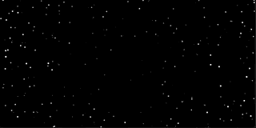

# P5.js Starfield Animation

A simple starfield animation. You can enable a warp/hyper/jump/-drive animation by pressing and holding the mouse button. While doing so, you are able to control the direction. A double click runs the animation fullscreen.

Made with [P5.js](https://p5js.org/).

[Click here to test the starfield in your browser.](https://codepen.io/achjaderleon/pen/MWbxNaY)

